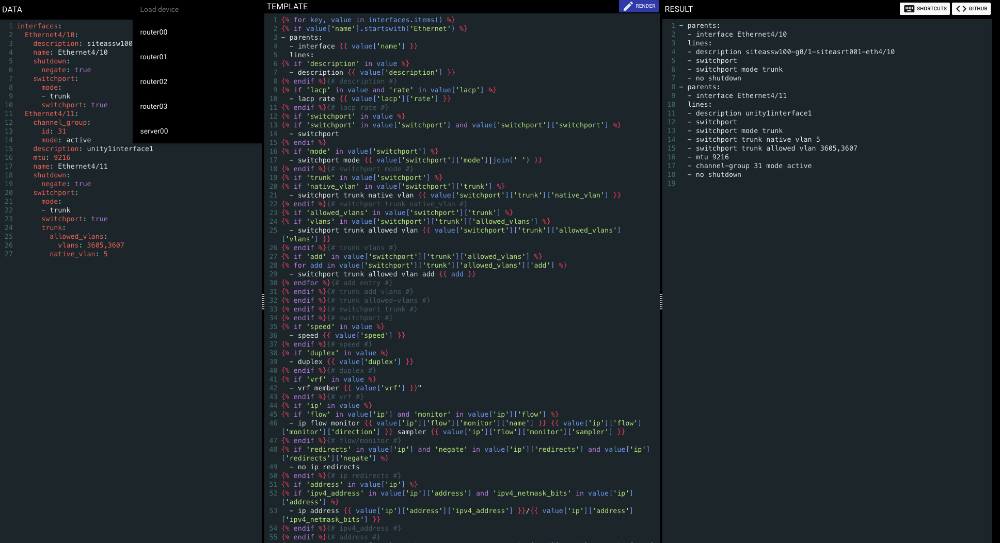

## Template Designer for Automation

TD4A is a visual design aid for building and testing Jinja2 templates and JSON schemas.

In Jinja2 mode, it accepts input data in YAML format and a Jinja2 template, then renders the output result for you.  
All default Jinja2 filters are supported along with the filter plugins from the latest Ansible version.

In schema mode, it accepts input data in JSON format and a JSON schema, then validates your JSON document against the provided JSON schema.

### Usage

```
docker run -p 5000:5000 ghcr.io/tigattack/td4a
```

Now browse to http://localhost:5000

#### Environment Variables

| Environment Variable    | Default Value              | Info                                                   |
|-------------------------|----------------------------|--------------------------------------------------------|
| `TD4A_UI_MODE`          | `jinja`                    | One of `jinja`, `schema`                               |
| `TD4A_CUSTOM_FILTERS`   | `src/my_filter_plugins`    | Supported in `jinja` mode only.                         |
| `TD4A_INVENTORY_SOURCE` | `src/my_ansible_inventory` |                                                        |
| `TD4A_VAULT_SECRET`     |                            |                                                        |
| `COUCHDB_URL`           |                            |                                                        |
| `COUCHDB_USERNAME`      |                            |                                                        |
| `COUCHDB_PASSWORD`      |                            |                                                        |
| `LOG_LEVEL`             | `INFO`                     | One of `DEBUG`, `INFO`, `WARNING`, `ERROR`, `CRITICAL` |

Each of these environment variables maps to a command-line argument. You can run `docker run --rm ghcr.io/tigattack/td4a:latest -h` to see command line arguments and valid inputs.

### Modes

TD4A support two different modes of operation.
- Templating: Build and render Jinja2 templates
- Schema: Build and validate a JSON schema for your data

#### Enabling a mode

```
docker run  -p 5000:5000 \
            -e "TD4A_UI_MODE=mode" \
            ghcr.io/tigattack/td4a:latest
```

where `TD4A_UI_MODE` is either `jinja` (default) or `schema`.

### Additional configuration options

#### Loading custom filter plugins

> [!NOTE]
> Supported in `jinja` mode only

TD4A supports custom filter plugins within the container. Pass your custom filter_plugins directory as a volume and use the `TD4A_CUSTOM_FILTERS` environment variable to specify to custom filter plugin directory.

```
docker run  -p 5000:5000 \
            -v /path/to/my_filter_plugins:/filter_plugins \
            -e "TD4A_CUSTOM_FILTERS=/filter_plugins" \
            ghcr.io/tigattack/td4a:latest
```

#### Loading an ansible inventory

TD4A supports a custom inventory within the container. Pass your custom inventory directory as a volume and use the `TD4A_INVENTORY_SOURCE` environment variable to specify to inventory directory:

```
docker run  -p 5000:5000 \
            -v /path/to/my_ansible_inventory:/inventory \
            -e "TD4A_INVENTORY_SOURCE=/inventory" \
            ghcr.io/tigattack/td4a:latest
```

If you have ansible-vault secrets in your inventory, you can also pass the vault password with the `TD4A_VAULT_SECRET` environment variable:

```
docker run  -p 5000:5000 \
            -v /path/to/my_ansible_inventory:/inventory \
            -e "TD4A_INVENTORY_SOURCE=/inventory" \
            -e "TD4A_VAULT_SECRET=my_vault_password" \
            ghcr.io/tigattack/td4a:latest
```

If environment variables are needed for a dynamic inventory, they can be passed to the container too:

```
docker run  -p 5000:5000 \
            -v /path/to/my_filter_plugins:/filter_plugins \
            -v /path/to/my_ansible_inventory:/inventory \
            -e "TD4A_CUSTOM_FILTERS=/filter_plugins" \
            -e "TD4A_INVENTORY_SOURCE=/inventory" \
            -e "TD4A_VAULT_SECRET=my_vault_password" \
            -e "DYNAMIC_INVENTORY_USERNAME=api" \
            -e "DYNAMIC_INVENTORY_PASSWORD=password" \
            ghcr.io/tigattack/td4a:latest
```            

#### Enabling storage and links using a couch database

TD4A has the ability to store data and templates in a CouchDB.  This is disabled by default.

The CouchDB needs to previously created.

To enable link support, and add the link button to the UI, set the following environment variables:

```
docker run  -p 5000:5000 \
            -v /path/to/my_filter_plugins:/filter_plugins \
            -e "COUCHDB_USERNAME=admin" \
            -e "COUCHDB_PASSWORD=password" \
            -e "COUCHCH_URL=http://192.168.1.5:5984/td4a" \
            ghcr.io/tigattack/td4a:latest
```


### User Interface

The interface is browser based and has been tested using Chrome and Firefox.

After following the instructions above to start TD4A, visit http://localhost:5000 to see the interface.

The UI is broken into three sections:

1. DATA: This is where the input data in YAML format (or JSON if using schema mode) is provided.
2. TEMPLATE or SCHEMA: This is where the Jinja2 template is provided, or JSON schema in schema mode.
3. RESULT: After clicking the render button or pressing the keybind (below), the result pane will be populated with the rendered template, or schema validation information in schema mode.

#### Keyboard shortcuts

`cmd+e`: Render the template

`cmd+s`: Save the data in browser local storage

`cmd+b`: Begin new, clear the screen
